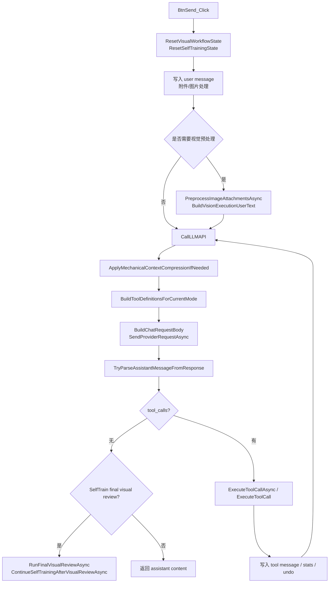
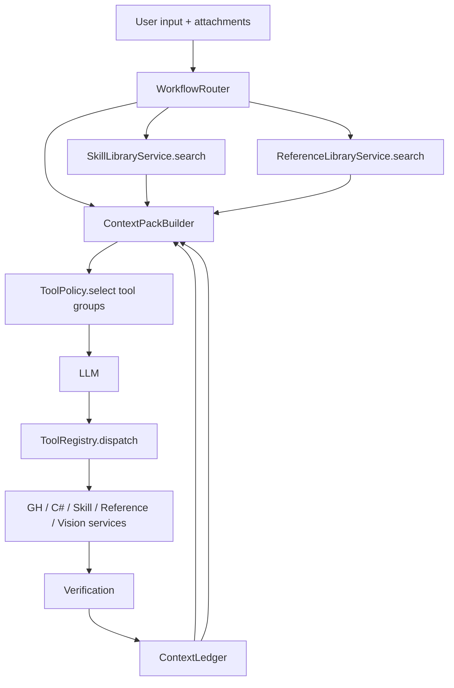

# ADD Agent 架构与代码审查报告

本文档基于当前仓库中的 agent 相关代码进行梳理和审查，重点关注：

- tools 调用链是否清晰；
- workflow 分流是否稳定；
- skill / reference 读取是否高效；
- 上下文管理是否兼顾 token 成本和准确性；
- 后续架构如何演进，避免继续堆 prompt 和 if/else。

审查范围主要包括：

- `ADDGH/ChatWindow.cs`
- `ADDGH/ChatWindow.ToolDefinitions.cs`
- `ADDGH/ChatWindow.ToolDispatch.cs`
- `ADDGH/ChatWindow.GhTools.Execution.cs`
- `ADDGH/ChatWindow.SkillTools.cs`
- `ADDGH/ChatWindow.ChatRendering.cs`
- `ADDGH/ChatWindow.ReferenceOptions.cs`
- `ADDGH/ChatWindow.PlanSteps.cs`
- `ADDGH/ChatWindow.VisualWorkflow.cs`
- `ADDGH/ChatWindow.Attachments.cs`
- `ADDGH/ChatWindow.LlmTransport.cs`
- `ADDGH/ChatWindow.WebResearch.cs`
- `ADDGH/ChatWindow.ImageWorkflow.cs`
- `ADDGH/ChatWindow.SelfTraining.cs`
- `ADDGH/ChatWindow.CanvasUndo.cs`
- `ADDGH/ChatMessageHelpers.cs`
- `ADDGH/DeploymentOptions.cs`
- `ADDGH/ChatWindow.RuntimeConfig.cs`
- `skills/`
- `reference/`

## 1. 总体结论

当前 ADD Agent 已经具备比较完整的能力闭环：

- 能通过 LLM function calling 控制 Grasshopper 画布；
- 能创建、编辑、连接、检查 GH 组件；
- 能专门处理 C# Script 组件；
- 能读取和导入 reference；
- 能读取和生成 skill；
- 能做图片预处理、最终视觉复核和 AI 图片生成；
- 能压缩上下文、折叠大型 tool output；
- 能做 canvas undo；
- 能通过 self-training 把成功经验写回 skill。

但架构上仍然更接近：

```text
大型 ChatWindow 状态机
+ 长 system prompt
+ 全量工具数组
+ 模式过滤 blocked set
+ 大 if/else dispatcher
+ markdown skill/reference 索引
+ 机械上下文压缩
```

这套方式短期可快速迭代，但已经出现混乱迹象：

- workflow 分流规则分散在 prompt、tool filter、视觉流程、自训练流程、UI 事件里；
- tool schema 描述大量仍为 `Description`，模型选工具时信号不足；
- skill 摘要全量注入 system，skill 增长后 token 成本和误匹配风险都会升高；
- reference 索引是 markdown 文档，不是机器可检索结构；
- 上下文压缩能省 token，但不能稳定保存“当前画布事实、已读 skill、已验证输出”等领域状态；
- tool dispatcher 和 GH execution 文件过大，新增工具会继续提高维护成本；
- 自训练 skill 写入缺少质量治理，长期会污染 skill 生态。

建议目标不是一次性大重构，而是分阶段引入三个核心层：

```text
WorkflowRouter -> ContextPackBuilder -> ToolPolicy
```

再配合：

```text
skills.index.json + reference.index.json + ContextLedger
```

让每轮模型只看到当前任务需要的上下文和工具。

## 2. 当前 Agent 调用链

主调用链集中在 `ChatWindow.cs`。



关键入口：

- `BtnSend_Click`：接收用户输入、附件、模式状态，并启动一轮对话。
- `BuildInitialSystemMessages`：构建 system prompt 和 skill 摘要。
- `CallLLMAPI`：压缩上下文、构造工具、请求模型、执行工具、递归续跑。
- `ExecuteToolCallAsync` / `ExecuteToolCall`：统一工具调度。
- `ExecuteGetGhComponents` 等 GH 工具：真实修改或读取 Grasshopper 画布。
- `ChatMessageHelpers`：负责消息压缩、tool-call 对齐、安全裁剪。

## 3. 文件级职责梳理

### 3.1 `ChatWindow.cs`

职责：

- 全局 UI 状态；
- `LayoutMode` / `AgentMode` 定义；
- 系统提示构造；
- 主发送按钮事件；
- LLM 主循环；
- rolling summary；
- skill 摘要注入；
- UI 侧消息展示部分入口。

主要问题：

- 单文件过大，包含 agent 主循环、UI、prompt、模式管理、上下文压缩等多种职责。
- `SYSTEM_PROMPT` 承担过多 workflow 规则，导致规则难测试。
- `BuildSystemPrompt`、`BuildModePrompt`、`GetModeSystemSkillPrompt`、`BuildCSharpDedicatedToolPrompt`、`BuildCSharpTypedInputPrompt` 之间有重叠规则。
- `GetSkillsSummary()` 每次扫描所有 markdown skill，把摘要全部注入 system。
- `TryApplyRollingSummaryInPlace()` 是简单截断摘要，不理解 GH 领域事实。

建议：

- 抽出 `AgentSession`，持有 `_messages`、mode、ledger、active route；
- 抽出 `PromptBuilder`；
- 抽出 `WorkflowRouter`；
- 抽出 `ContextCompressor`；
- `ChatWindow` 保留 UI 入口和渲染，不再承载 agent 策略。

### 3.2 `ChatWindow.ToolDefinitions.cs`

职责：

- 构造所有 function calling tool schema；
- 按当前 `LayoutMode` / `AgentMode` 过滤工具；
- 在 C# priority 模式下调整部分工具描述。

主要问题：

- 大量工具和字段 description 仍是 `"Description"`。
- 工具没有分组概念，当前靠 blocked set 排除。
- `FilterToolsForVisionContext()` 目前直接返回原工具，没有实际视觉上下文策略。
- C# first 下禁用了部分工具，但同类约束还散落在 system prompt 中。
- `create_ai_image` 的 description 明显错误，写成了动态端口修改相关内容。

影响：

- 工具选择准确性下降；
- 模型需要读更长的 system prompt 才知道工具用途；
- token 成本高；
- 新增工具时容易忘记更新过滤逻辑；
- workflow 分流不可观测。

建议：

引入工具注册表：

```csharp
sealed class AgentToolSpec
{
    public string Name;
    public string Group;
    public bool MutatesCanvas;
    public Func<object> BuildSchema;
    public Func<JObject, ToolExecutionContext, Task<ToolDispatchResult>> Execute;
    public ToolModePolicy Policy;
}
```

工具组建议：

- `inspect`
- `native_graph`
- `csharp`
- `reference`
- `skill`
- `verify`
- `visual`
- `image`
- `web`
- `ui_interaction`

每轮只暴露 route 允许的工具组。

### 3.3 `ChatWindow.ToolDispatch.cs`

职责：

- 解析工具参数；
- 执行同步或异步工具；
- 创建 undo snapshot；
- 统计新增/删除组件、连线、代码行；
- 处理特殊 UI 工具的早停。

主要问题：

- 一个大 if/else dispatcher 承担所有工具族。
- 统计、undo、early response、工具执行混在一起。
- `IsCanvasMutatingTool` 在 `CanvasUndo.cs`，但 dispatch 依赖它，职责分散。
- 异步工具只特殊处理 `create_ai_image`、`capture_rhino_viewport`、`web_research`，未来扩展成本高。
- `operationCards.Select(...).ToList()` 传给工具时丢失 undoId，说明 UI 卡片和执行结果之间的绑定还不完整。

建议：

- 改为工具注册表分发；
- 每个工具返回结构化结果：

```json
{
  "status": "ok|error|awaiting_user",
  "summary": "...",
  "mutated_canvas": true,
  "stats": {},
  "ledger_patch": {},
  "display_cards": []
}
```

- dispatcher 只负责通用生命周期：undo、执行、消息写入、ledger update、递归续跑。

### 3.4 `ChatWindow.GhTools.Execution.cs`

职责：

- Grasshopper 画布读写；
- public short id 映射；
- 组件 JSON 导出；
- 组件查询；
- 组件创建、连接、删除；
- C# Script 创建、端口配置、body 替换、typed alias 注入；
- GH error 检查；
- 截图与预览；
- group 管理；
- component catalog 搜索。

优点：

- public short id 机制是正确方向，可以减少 token 和避免 GUID 暴露。
- `ExecuteGetGhComponents` 有缓存和 Rhino unit signature，能减少重复导出。
- C# Script 工具有较多防御逻辑，包括 type hint normalize、typed input alias、输出变量校验。

主要问题：

- 文件过大，职责过多。
- `ExecuteGetGhComponents` 返回可能很大，虽然有历史折叠，但当前轮仍可能消耗大量 token。
- C# Script 创建、端口配置、body 替换、typed alias 注入都在同一文件里，难测试。
- `ExecuteCaptureRhinoViewport` 相关工具被系统提示说“不暴露”，但代码和部分流程仍存在，容易形成策略分叉。
- 查询工具和全量读取工具没有强制使用策略，模型可能过度调用全量 `get_gh_components`。

建议：

- 拆分为：
  - `GhCanvasInspector`
  - `GhCanvasMutator`
  - `GhComponentCatalog`
  - `CSharpScriptComponentService`
  - `GhVerificationService`
  - `GhPreviewCaptureService`
  - `GhGroupService`
- 增加 `get_canvas_digest` 或 `get_context_ledger`，让模型优先读轻量摘要；
- `get_gh_components` 增加参数：

```json
{
  "scope": "summary|full|selection|errors|scripts|component",
  "include_script_bodies": false,
  "max_components": 50
}
```

### 3.5 `ChatWindow.SkillTools.cs`

职责：

- `read_skill_file`
- `read_reference_json`
- `import_reference_gh`
- `create_gh_skill`

优点：

- 文件读取做了 `Path.GetFileName`，避免直接路径穿越。
- reference GH 导入限制在 reference 目录内。
- import 后会刷新 public id map 和 canvas cache。

主要问题：

- `read_skill_file` 读取完整 markdown，没有大小限制、摘要模式或分段读取。
- `create_gh_skill` 直接写 markdown，没有校验 frontmatter、slug、重复、质量分。
- skill 与 reference 的索引关系靠 markdown 文本维护。
- 没有 skill 检索工具，模型只能从 system 注入摘要里挑。

建议：

- 新增 `search_skills`，从结构化 index 检索 top-k；
- `read_skill_file` 支持 `section` 或 `max_chars`；
- `create_gh_skill` 改成写入前校验并同步 `skills.index.json`；
- system prompt 不再注入全部 skill 摘要，只注入候选 skill 摘要。

### 3.6 `ChatWindow.ChatRendering.cs`

职责中与 agent 相关的部分：

- 保存当前画布为 reference；
- enrich reference JSON；
- 从 reference 中抽取 C# Script 代码并生成对应 skill；
- 更新 `skills/reference_index.md`；
- 定位项目根目录、skills 目录、reference 目录。

主要问题：

- reference 保存逻辑混在聊天渲染文件中，职责不清。
- `reference_index.md` 被当成索引数据库使用，但它是自然语言 markdown。
- `ReadReferenceIndexEntries` 依赖 regex 解析 markdown，脆弱。
- reference 保存只追加 markdown，不更新机器索引。

建议：

- 抽出 `ReferenceLibraryService`；
- 用 `reference.index.json` 作为主索引；
- markdown 作为展示/说明生成物；
- reference 条目包含 `triggers`、`domains`、`skill_file`、`gh_file/json_file`、`dependencies`、`incompatible_with`。

### 3.7 `ChatWindow.ReferenceOptions.cs`

职责：

- “创建参考”时让模型生成 5 个候选描述；
- UI 展示候选；
- 用户选择后调用 `SaveReference`。

优点：

- 有前置检查：画布可读、非空、无 GH Error。
- 这是一个明确的 human-in-the-loop 交互点。

主要问题：

- 工具 schema 和错误提示包含较多 prompt 规则，说明 workflow 约束没有集中治理。
- 只支持 5 条候选描述，不包含结构化 tags、domains、trigger、quality。

建议：

- 候选项改为结构化：

```json
{
  "title": "...",
  "description": "...",
  "domains": ["axis", "dimension"],
  "triggers": ["轴网", "标注"],
  "reuse_type": "reference_json|gh_import|skill"
}
```

### 3.8 `ChatWindow.PlanSteps.cs`

职责：

- Plan 模式下展示实施计划卡片；
- 用户点击后切回 Create 模式并执行完整 prompt。

优点：

- schema 较清晰；
- Plan 模式只开放有限工具，安全性较好；
- 有 `execute_prompt`，可把计划转成执行指令。

主要问题：

- Plan 到 Create 的传递仍是自然语言 prompt，不是结构化 route。
- 计划步骤不会进入 ledger，后续执行时模型可能偏离计划。

建议：

- plan payload 中加入结构化 `route_hint`、`tool_groups`、`skill_candidates`、`reference_candidates`；
- 点击执行后把 plan payload 写入 ContextLedger，而不是只拼自然语言。

### 3.9 `ChatWindow.VisualWorkflow.cs` 与 `ChatWindow.Attachments.cs`

职责：

- 图片附件预处理；
- 主模型是否直接接收图片的路由；
- 构造视觉预处理请求；
- 构造最终视觉复核请求；
- self-training 视觉验收闭环。

优点：

- 明确区分“视觉预处理模型”和“主执行模型”。
- prompt 中多次强调视觉事实、画布事实、推断要分开。
- self-training 会结合 GH check 和视觉复核再写 skill。

主要问题：

- 图片路由目前只有 `None` / `ImageAttached`，语义太粗。
- 视觉预处理会读取画布上下文，可能引入额外 token 成本。
- final visual review 只在 SelfTrain 模式自动触发，普通 Create 模式下更多依赖数据级验证。
- `CanUseViewportCaptureTool()` 返回 true，但截图工具对 AI tool 又被提示不暴露，策略不统一。

建议：

图片 intent 应结构化：

```text
image_explain
image_to_gh_model
image_to_ai_image
image_as_error_screenshot
image_as_material_reference
ambiguous
```

视觉预处理输出应进入 ledger：

```json
{
  "vision_facts": [],
  "canvas_clues": [],
  "uncertainties": [],
  "suggested_intent": "..."
}
```

### 3.10 `ChatWindow.LlmTransport.cs`

职责：

- 构造 OpenAI-compatible request；
- endpoint fallback；
- provider HTTP 请求；
- response 读取；
- vision preprocess 的 HTTP 流程；
- outbound message normalize。

主要问题：

- transport 与 vision preprocess 部分混在一起。
- `BuildChatRequestBody` 永远带 `temperature = 0.3`，缺少按 workflow 调整。
- provider `SupportsTools` 为 false 时工具不会传，但主流程仍可能依赖工具能力，需要更明确的 provider capability check。

建议：

- 抽出 `LlmClient`；
- 抽出 `VisionClient`；
- route 中记录本轮需要 tools / vision / image，如果 provider 不支持，提前阻断。

### 3.11 `ChatWindow.WebResearch.cs`

职责：

- `web_research` 工具；
- 优先搜索 McNeel API docs；
- fallback 到 Bing；
- fetch URL；
- allowed_domains 限制。

优点：

- 对 RhinoCommon / Grasshopper API 有专门搜索逻辑。
- 禁止 localhost 和带 credentials URL。
- 支持 allowed domains。

主要问题：

- web research 是通用工具，但当前主要服务 Rhino/GH API 查证。
- 搜索结果进入 tool output，可能较大。
- 没有把“已查证 API”写入稳定上下文或缓存 ledger。

建议：

- 拆成 `search_api_docs` 和 `web_research`；
- Rhino/GH API 走本地 `reference/api_index` 优先；
- 查证结果写入 ledger：

```json
{
  "api_facts": [
    { "symbol": "LinearDimension", "source": "...", "summary": "..." }
  ]
}
```

### 3.12 `ChatWindow.ImageWorkflow.cs`

职责：

- AI 图片生成；
- CanvasWeb 中图片节点生成；
- Gemini native image endpoint；
- image task / chat completion fallback。

主要问题：

- 与 GH 建模 agent 共享同一个 tool definitions 层，但本质是另一类 workflow。
- `create_ai_image` schema 描述错误，会影响模型判断。
- 图片生成结果不应污染 GH 画布上下文。

建议：

- image workflow 独立 route；
- 当 route 为 `image_generate` 时，只暴露 image 工具和少量上下文；
- 不注入 GH skill/reference 摘要，降低 token。

### 3.13 `ChatWindow.SelfTraining.cs`

职责：

- 自训练状态机；
- 多轮修复；
- 达标后生成 trained skill；
- 追加 reference index；
- 等待用户反馈并更新同一个 skill。

优点：

- 有最大迭代次数；
- 写 skill 前结合 GH check、视觉复核、skill suitable；
- 能在用户后验反馈后更新同一个 skill。

主要问题：

- trained skill 的质量治理不足。
- skill slug 和 title 主要来自视觉模型或 fallback。
- 追加 `reference_index.md`，没有结构化索引。
- 对已有相似 skill 不做合并或降权。
- 自训练 skill 生成内容可能包含一次性上下文，缺少可复用边界校验。

建议：

trained skill 写入时同步生成：

```json
{
  "file": "trained_xxx.md",
  "type": "trained",
  "quality": 0.0,
  "verified_at": "...",
  "source_goal": "...",
  "triggers": [],
  "domains": [],
  "limitations": [],
  "requires_visual_review": true,
  "status": "candidate|approved|deprecated"
}
```

默认 `trained` skill 不应高优先级进入主上下文，除非相似度高且质量分达标。

### 3.14 `ChatWindow.CanvasUndo.cs`

职责：

- Canvas mutating tool 的 undo snapshot；
- delta snapshot；
- undo UI；
- 撤销后截断对话上下文；
- 尝试保留用户引用几何参数。

优点：

- 把画布状态和对话上下文一起处理，是正确方向。
- 撤销后截断对应 tool call 之后的对话，避免上下文引用不存在的画布状态。

主要问题：

- undo 逻辑与 agent 状态强耦合。
- `TryUndoCanvasOperation` 中存在早期 `return`，后面一大段旧逻辑不可达，说明历史逻辑未清理。
- undo marker 是 system message，但没有进入结构化 ledger。

建议：

- undo 后更新 ContextLedger：

```json
{
  "canvas_undo": {
    "undone_tool_call_id": "...",
    "invalidated_after": "...",
    "affected_operations": 3
  }
}
```

- 清理不可达旧逻辑。

### 3.15 `ChatMessageHelpers.cs` 与 `DeploymentOptions.cs`

职责：

- 投影发送消息；
- 折叠旧 `get_gh_components`；
- 折叠大型 tool output；
- token 粗估；
- Tier0/Tier1/Tier2 边界；
- 安全裁剪 tool-call 组合；
- rolling summary header 和预算参数。

优点：

- 保留 system prefix；
- 保留 rolling summary；
- 尽量避免 tool message 和 assistant tool_call 断裂；
- 折叠历史大工具输出。

主要问题：

- token 估算是 `json.Length / 3`，只能粗略参考。
- rolling summary 是消息文本截断，不是语义摘要。
- 没有专门保留 GH 事实、skill 选择、reference 选择、验证结果。
- 大型 tool output 只按 function name 保留最后一次，可能丢失关键历史依据。

建议：

- 引入 `ContextLedger`；
- `ProjectMessagesForSend` 输出：

```text
Tier0: stable system prompt
Tier0b: current route + context ledger
Tier1: rolling conversation summary
Tier2: recent raw messages
```

- 大工具输出折叠时把关键摘要写入 ledger。

## 4. 当前 Workflow 分流问题

当前分流来源有多处：

- UI mode：`LayoutMode`、`AgentMode`
- system prompt：大量自然语言规则
- mode system skill：`system_csharp_mode.md`、`system_mixed_mode.md`
- tool filter：blocked / allowed 工具列表
- visual workflow：图片预处理和自训练复核
- special UI tools：Plan steps、Reference options
- self-training 状态机

这种分流方式的问题是：

```text
规则分散 -> 难以观测 -> 难以测试 -> 容易互相冲突 -> 只能继续加 prompt 修补
```

建议新增显式 `WorkflowRouter`。

每轮用户输入后先生成：

```json
{
  "intent": "create|modify|repair|plan|explain|self_train|image_generate|image_edit|reference_save",
  "layout_strategy": "battery|mixed|csharp_first",
  "canvas_scope": "none|summary|full|component|errors",
  "needs_skill_lookup": true,
  "needs_reference_lookup": false,
  "needs_web": false,
  "needs_vision": false,
  "allowed_tool_groups": ["inspect", "csharp", "verify"],
  "context_budget": "small|medium|large",
  "risk_level": "low|medium|high"
}
```

Router 可以先用规则实现，不必一开始就调用模型：

- 有图片且用户说“生成图片/改图” -> `image_generate`
- AgentMode=Plan -> `plan`
- AgentMode=SelfTrain -> `self_train`
- LayoutMode=CSharpFirst -> `layout_strategy=csharp_first`
- 用户说“报错/修复/不对/null” -> `repair`
- 用户说“解释/怎么看/为什么” -> `explain`
- 其余 GH 任务 -> `create|modify`

## 5. Tool Policy 建议

当前工具过滤是直接 blocked set。建议改为工具组策略：

| Workflow | 默认工具组 |
|---|---|
| explain | `inspect`, `skill`, `web` |
| plan | `inspect`, `skill`, `reference`, `web`, `ui_interaction` |
| create battery | `inspect`, `native_graph`, `verify`, `skill`, `reference` |
| create csharp | `inspect`, `csharp`, `verify`, `skill`, `reference` |
| modify | `inspect`, `native_graph` or `csharp`, `verify` |
| repair | `inspect`, `verify`, `read_component_script`, `csharp`, `native_graph`, `web` |
| image_generate | `image` |
| self_train | `inspect`, `native_graph`, `csharp`, `verify`, `visual` |
| reference_save | `inspect`, `verify`, `ui_interaction`, `reference` |

工具暴露原则：

1. 本轮不需要的工具不发送给模型。
2. 读工具优先于写工具。
3. 高成本工具需要 route 明确允许。
4. 全量 canvas 工具需要 scope 限制。
5. skill/reference 工具先 search，再 read。
6. web 工具默认关闭，除非 API 不确定或用户明确要求。

## 6. Skill 生态治理建议

### 6.1 新增 `skills/skills.index.json`

示例：

```json
[
  {
    "file": "system_csharp_mode.md",
    "name": "system-csharp-mode",
    "type": "system",
    "domains": ["workflow", "csharp"],
    "triggers": ["C#优先", "CSharpFirst"],
    "layout_modes": ["csharp_first"],
    "priority": 100,
    "quality": 1.0,
    "status": "active"
  },
  {
    "file": "official_rhino_axis_with_dimensions_csharp.md",
    "name": "official-rhino-axis-with-dimensions",
    "type": "official",
    "domains": ["axis", "dimension", "annotation"],
    "triggers": ["轴网并标注", "轴号", "逐跨尺寸", "总尺寸"],
    "layout_modes": ["mixed", "csharp_first"],
    "priority": 90,
    "quality": 0.95,
    "status": "active"
  }
]
```

### 6.2 新增 skill 检索流程

当前：

```text
所有 skill 摘要 -> system prompt -> 模型自己判断 -> read_skill_file
```

建议：

```text
用户输入 + route + ledger
-> search_skills(top_k=5)
-> 只注入候选 skill 摘要
-> 必要时 read_skill_file
```

### 6.3 Skill 分层

| 类型 | 说明 | 默认策略 |
|---|---|---|
| system | 模式级规则 | 宿主按 mode 注入 |
| official | 高可信官方/人工整理经验 | 高优先级候选 |
| reference | 从 reference 自动抽出的 C# | 仅 reference 匹配后读取 |
| trained | 自训练经验 | 质量分达标且高相似才候选 |
| draft | 草稿 | 默认不参与 |
| deprecated | 废弃 | 不参与 |

## 7. Reference 生态治理建议

当前 `reference_index.md` 内容很有价值，但不适合作为唯一索引。

建议新增 `reference/reference.index.json`：

```json
[
  {
    "id": "axis-with-dimensions",
    "title": "一体化建筑轴网和尺寸标注",
    "description": "导入 00 axis with dimensions.gh，一次生成轴线、轴号、逐跨尺寸和总尺寸。",
    "triggers": ["轴网并标注", "5*5轴网", "轴号泡泡", "逐跨尺寸"],
    "domains": ["axis", "dimension"],
    "gh_file": "00 axis with dimensions.gh",
    "json_file": null,
    "skill_file": "official_rhino_axis_with_dimensions_csharp.md",
    "dependencies": [],
    "incompatible_with": ["axis.gh + 02 dimensions.gh"],
    "priority": 90,
    "status": "active"
  }
]
```

reference 选择流程：

```text
route.needs_reference_lookup
-> search_references(top_k=3)
-> read_skill_file(reference.skill_file)
-> import_reference_gh 或 read_reference_json
```

## 8. ContextLedger 建议

当前上下文压缩解决的是“消息太长”，但没有解决“重要事实在哪里”。

建议新增 `ContextLedger`：

```json
{
  "goal": "当前用户目标",
  "route": {
    "intent": "create",
    "layout_strategy": "mixed"
  },
  "active_skills": [
    {
      "file": "official_rhino_axis_with_dimensions_csharp.md",
      "reason": "用户要求轴网并标注"
    }
  ],
  "active_references": [
    {
      "file": "00 axis with dimensions.gh",
      "status": "imported",
      "reason": "一体化轴网标注"
    }
  ],
  "canvas_facts": {
    "key_components": [
      {
        "id": "01",
        "name": "AxisGrid",
        "role": "main script",
        "stable": true
      }
    ],
    "do_not_rewrite_without_reason": ["01"]
  },
  "verification": {
    "last_gh_error_check": "clean",
    "validated_outputs": ["AxisLines non-empty", "Dimensions non-empty"],
    "unverified": ["visual spacing"]
  },
  "api_facts": [],
  "open_issues": []
}
```

注入方式：

```text
system 1: stable base prompt
system 2: current route + context ledger + selected skill summaries
assistant: rolling summary
tail: recent raw messages
```

这样做的收益：

- token 成本下降；
- 历史 tool output 可大胆折叠；
- 模型不需要反复读完整 canvas；
- undo 后可以精确 invalidation；
- self-training 可以写入更可靠的 skill。

## 9. 准确性策略

为了保证准确性，不建议只靠模型“自觉检查”。应把验证变成 workflow 必经阶段。

建议每轮 mutating tool 后：

1. 自动记录 canvas mutated。
2. 根据 route 决定验证策略：
   - 普通建模：`check_gh_errors` + 关键输出非空；
   - C# Script：读取目标组件 context，检查输出变量和 runtime messages；
   - reference 导入：检查导入数量和关键组件存在；
   - repair：复查原错误组件；
   - self-train：GH check + final visual review。
3. 验证结果写入 ledger。
4. 没有验证通过时，最终回复不得宣称完成。

## 10. Token 成本策略

优先级从高到低：

1. 不暴露无关工具。
2. 不注入全部 skill 摘要。
3. 不读取完整 skill，先 search top-k。
4. 不读取完整 canvas，先 digest / query。
5. 不重复发送历史大 tool output。
6. 用 ledger 保存关键事实。
7. reference / API 查证结果做短摘要缓存。
8. 图片任务不要注入 GH skill/reference，除非 route 是 image-to-GH。

## 11. 分阶段落地计划

### 阶段 1：低风险修复

1. 修正 `create_ai_image` tool description。
2. 给所有关键 tools 补完整 description。
3. 把 tool definitions 按 group 拆成局部方法。
4. 新增 `ToolGroup` 字段，即使暂时仍用 blocked set。
5. 新增 `skills.index.json`，人工先维护官方 skill 和 system skill。
6. `GetSkillsSummary()` 改为最多注入 top 5 或按类型注入。

### 阶段 2：结构化索引

1. 新增 `search_skills`。
2. 新增 `reference.index.json`。
3. 新增 `search_references`。
4. 自训练写 skill 时同步写 `skills.index.json`。
5. 保存 reference 时同步写 `reference.index.json`。

### 阶段 3：显式 Router 和 Tool Policy

1. 新增 `WorkflowRoute` 类型。
2. 在 `BtnSend_Click` 后、写入主模型前生成 route。
3. `BuildToolDefinitionsForCurrentMode(route)` 依据 route 暴露工具组。
4. Plan card 的 execute prompt 同时携带 route hint。

### 阶段 4：ContextLedger

1. 新增 ledger 数据结构。
2. 工具执行结果返回 `ledger_patch`。
3. `ProjectMessagesForSend` 注入 ledger。
4. undo、self-training、reference 导入都更新 ledger。
5. rolling summary 降级为补充，不再承担事实保存。

### 阶段 5：服务拆分

拆出：

- `AgentSession`
- `PromptBuilder`
- `WorkflowRouter`
- `ToolRegistry`
- `ToolPolicy`
- `GhCanvasInspector`
- `GhCanvasMutator`
- `CSharpScriptComponentService`
- `SkillLibraryService`
- `ReferenceLibraryService`
- `ContextLedgerService`
- `LlmClient`
- `VisionClient`

## 12. 优先级最高的问题清单

### P0：工具 schema 描述大量为空

影响：

- 工具误调用；
- workflow 混乱；
- token 成本变高。

建议立即修复。

### P0：Skill 全量摘要注入 system

影响：

- skill 越多越慢；
- token 成本持续上涨；
- trained skill 会污染上下文。

建议尽快改为 top-k。

### P1：缺少显式 WorkflowRouter

影响：

- 分流不可观测；
- 规则冲突难排查；
- 新 workflow 只能继续加 prompt。

建议作为第二阶段核心改造。

### P1：缺少 ContextLedger

影响：

- 上下文压缩后丢事实；
- 模型反复查 canvas；
- 已验证结果不稳定保存。

建议和 Router 一起设计。

### P1：Reference / Skill 索引非结构化

影响：

- markdown regex 脆弱；
- reference 增长后检索不稳定；
- self-training 结果难治理。

建议引入 JSON index。

### P2：Dispatcher 和 GH execution 文件过大

影响：

- 维护成本高；
- 测试困难；
- 新工具容易破坏旧逻辑。

建议在策略稳定后拆分。

## 13. 推荐目标架构



关键原则：

- Router 决定本轮做什么；
- Skill / Reference 先检索，后读取；
- ToolPolicy 决定能用什么；
- Ledger 保存事实；
- Prompt 只表达稳定原则，不承载所有分流细节；
- Dispatcher 不再知道所有工具细节。

## 14. 最小可执行改造方案

如果只做一轮小改，建议按这个顺序：

1. 建 `skills/skills.index.json`。
2. 改 `GetSkillsSummary()`：
   - system skill 按 mode 注入；
   - official/trained skill 只注入 top-k；
   - trained 默认最多 2 个。
3. 给 10 个核心工具补 description：
   - `get_gh_components`
   - `query_gh_components`
   - `get_component_context`
   - `create_component_graph`
   - `create_csharp_script_component`
   - `edit_csharp_script_component`
   - `check_gh_errors`
   - `read_skill_file`
   - `read_reference_json`
   - `import_reference_gh`
4. 新增一个简单 route 对象，只用于 tool group filter。
5. `BuildToolDefinitionsForCurrentMode()` 改成：

```text
all tools -> mode policy -> route tool groups -> provider capability -> schema output
```

这一步不需要重构 GH 执行逻辑，但会显著改善效率、token 成本和准确性。

