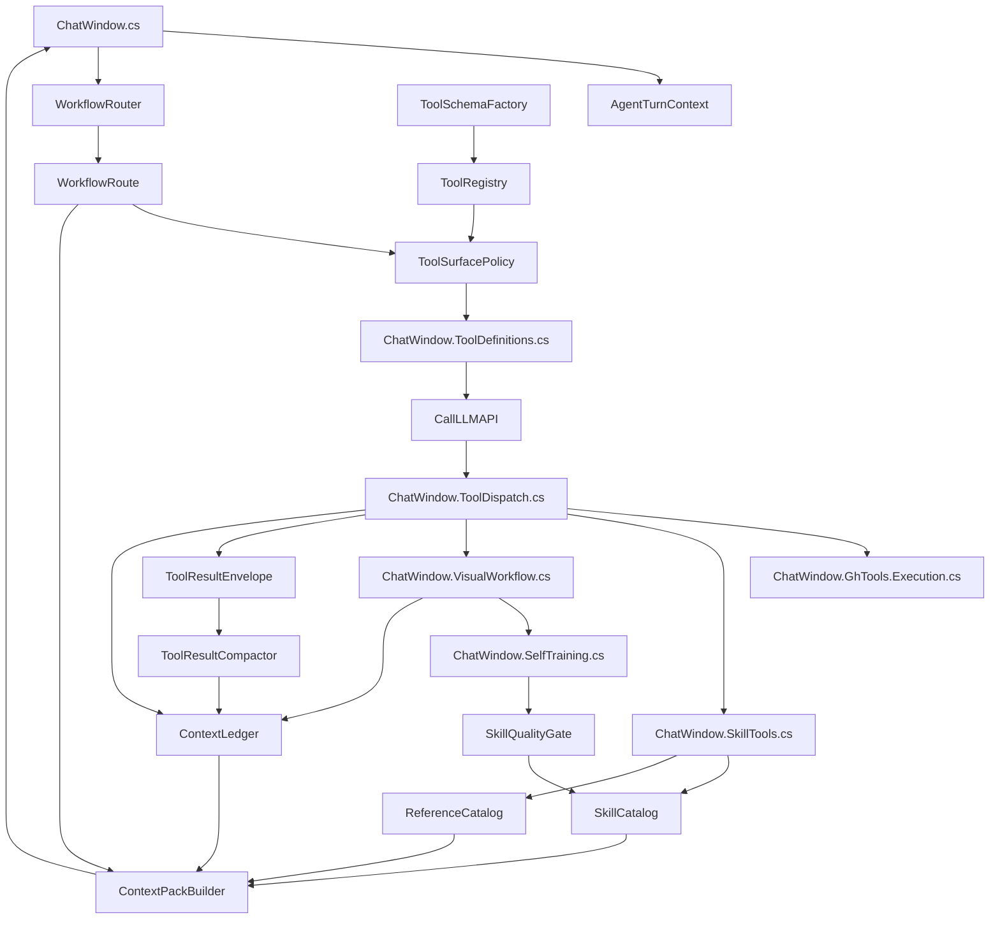

# ADD Agent 架构优化实施任务规划

本文把 agent 架构优化拆成可执行任务，精确到要改造的现有代码文件、要新增的代码文件、每个文件的职责，以及文件之间的调用关系。

目标聚焦三件事：

- 降低工具调用混乱：让每轮只暴露当前 workflow 需要的工具。
- 降低 token 成本：skill/reference/tool/schema/context 按需注入。
- 提高准确性：用结构化 workflow route、tool evidence、skill quality gate 约束模型行为。

## 0. 当前关键文件定位

当前 agent 主链路主要分布在以下文件：

- `ADDGH/ChatWindow.cs`
  - `SYSTEM_PROMPT`
  - `BuildSystemPrompt`
  - `BuildInitialSystemContent`
  - `BuildInitialSystemMessages`
  - `GetModeSystemSkillPrompt`
  - UI 状态和 agent mode/layout mode。
- `ADDGH/ChatWindow.ToolDefinitions.cs`
  - `BuildToolDefinitionsForCurrentMode`
  - 当前所有 function tool schema 的主要拼装位置。
- `ADDGH/ChatWindow.ToolDispatch.cs`
  - `ExecuteToolCall`
  - `ExecuteToolCallAsync`
  - 工具名到具体执行方法的大 if/else dispatcher。
- `ADDGH/ChatWindow.SkillTools.cs`
  - `ExecuteReadSkillFile`
  - `ExecuteReadReferenceJson`
  - `ExecuteImportReferenceGh`
  - `ExecuteCreateGhSkill`
- `ADDGH/ChatWindow.ChatRendering.cs`
  - reference 保存、reference index、skill UI、`GetSkillsDirectory`、`GetReferenceDirectory`。
- `ADDGH/ChatWindow.VisualWorkflow.cs`
  - 视觉复核、自训练视觉判定、修复迭代入口。
- `ADDGH/ChatWindow.SelfTraining.cs`
  - self-training 状态、skill 写入、训练索引追加。
- `ADDGH/ChatWindow.GhTools.Execution.cs`
  - Grasshopper/Rhino 工具执行主体。
- `ADDGH/ChatMessageHelpers.cs`
  - 大 tool result 折叠、消息辅助处理。
- `ADDGH/DeploymentOptions.cs`
  - 部署与 prompt/system message 开关。

`ADDGH/ADDGH.csproj` 是 SDK-style project，新增 `ADDGH/Agent/*.cs` 默认会自动编译，不需要手动加入 `<Compile Include=...>`。

## 1. 目标架构

目标调用链从现在的：

```text
BuildSystemPrompt
-> GetSkillsSummary
-> BuildToolDefinitionsForCurrentMode
-> CallLLMAPI
-> ExecuteToolCall / ExecuteToolCallAsync
-> 大量工具结果直接回写 messages
```

调整为：

```text
AgentTurnContextFactory
-> WorkflowRouter
-> SkillCatalog.Search
-> ContextPackBuilder
-> ToolSurfacePolicy.BuildToolCatalog
-> CallLLMAPI
-> ToolDispatch
-> ContextLedger.RecordToolResult
-> ToolResultCompactor
```

第一阶段不重写 `CallLLMAPI` 主循环，只在现有入口旁边插入新层，降低风险。

## 2. 新增目录与文件总览

建议新增目录：

```text
ADDGH/Agent/
```

新增代码文件：

```text
ADDGH/Agent/AgentTurnContext.cs
ADDGH/Agent/WorkflowIntent.cs
ADDGH/Agent/WorkflowRoute.cs
ADDGH/Agent/WorkflowRouter.cs
ADDGH/Agent/ToolLifecycle.cs
ADDGH/Agent/ToolDescriptor.cs
ADDGH/Agent/ToolRegistry.cs
ADDGH/Agent/ToolSurfacePolicy.cs
ADDGH/Agent/ToolSchemaFactory.cs
ADDGH/Agent/SkillCatalog.cs
ADDGH/Agent/SkillIndexModels.cs
ADDGH/Agent/SkillQualityGate.cs
ADDGH/Agent/ReferenceCatalog.cs
ADDGH/Agent/ReferenceIndexModels.cs
ADDGH/Agent/ContextLedger.cs
ADDGH/Agent/ContextPackBuilder.cs
ADDGH/Agent/ToolResultEnvelope.cs
ADDGH/Agent/ToolResultCompactor.cs
```

新增数据文件：

```text
skills/skills.index.json
reference/reference.index.json
```

新增文档或测试辅助：

```text
ADD_Agent/docs/agent_optimization_task_plan.md
ADD_Agent/docs/codewhale_agent_framework_comparison.md
```

如果后续建立测试项目，再新增：

```text
ADDGH.Tests/WorkflowRouterTests.cs
ADDGH.Tests/ToolSurfacePolicyTests.cs
ADDGH.Tests/SkillCatalogTests.cs
ADDGH.Tests/ContextLedgerTests.cs
```

## 3. 文件职责与关联

### 3.1 `AgentTurnContext.cs`

职责：收集一轮请求的稳定输入，作为 router、context builder、tool policy 的共同输入。

建议结构：

```csharp
namespace ADDGH.Agent;

public sealed class AgentTurnContext
{
    public string UserText { get; set; }
    public string LayoutMode { get; set; }
    public string AgentMode { get; set; }
    public bool HasAttachments { get; set; }
    public bool HasImageAttachments { get; set; }
    public bool CanvasAvailable { get; set; }
    public bool CanvasLikelyEmpty { get; set; }
    public string LastToolName { get; set; }
    public bool LastToolFailed { get; set; }
    public IReadOnlyList<string> RecentlyLoadedSkills { get; set; }
    public IReadOnlyList<string> RecentReferenceFiles { get; set; }
}
```

关联：

- 由 `ChatWindow.cs` 在发送前创建。
- 输入给 `WorkflowRouter.Route(context)`。
- 输入给 `ContextPackBuilder.Build(context, route, ledger)`。

需要改造的现有文件：

- `ADDGH/ChatWindow.cs`
  - 在 `BuildInitialSystemMessages` 或 `CallLLMAPI` 前后创建当前 turn context。
  - 初期可用静态 helper 包装，不改变 UI 主流程。

### 3.2 `WorkflowIntent.cs`

职责：定义标准 workflow intent，替代散落的 prompt 规则和状态判断。

建议枚举：

```csharp
namespace ADDGH.Agent;

public enum WorkflowIntent
{
    GeneralChat,
    GrasshopperCreate,
    GrasshopperModify,
    CSharpScriptCreate,
    CSharpScriptFix,
    VisualUnderstanding,
    VisualModeling,
    AiImageGeneration,
    SkillLookup,
    SkillAuthoring,
    ReferenceLookup,
    ReferenceImport,
    SelfTraining,
    WebResearch
}
```

关联：

- `WorkflowRoute.Intent`
- `ToolDescriptor.IntendedWorkflows`
- `SkillIndexEntry.Workflows`
- `ContextPackBuilder` 根据 intent 选择上下文。

### 3.3 `WorkflowRoute.cs`

职责：保存路由结果，不让 workflow 决策只存在 prompt 里。

建议结构：

```csharp
namespace ADDGH.Agent;

public sealed class WorkflowRoute
{
    public WorkflowIntent Intent { get; set; }
    public double Confidence { get; set; }
    public string Reason { get; set; }
    public List<string> RequiredTools { get; } = new List<string>();
    public List<string> OptionalTools { get; } = new List<string>();
    public List<string> ContextPacks { get; } = new List<string>();
    public bool RequiresVisualReview { get; set; }
    public bool AllowsCanvasMutation { get; set; }
    public bool AllowsSkillWrite { get; set; }
    public bool ShouldAskClarifyingQuestion { get; set; }
}
```

关联：

- `WorkflowRouter` 生成。
- `ToolSurfacePolicy` 消费。
- `ContextPackBuilder` 消费。
- `ContextLedger` 记录当前 route。

### 3.4 `WorkflowRouter.cs`

职责：用可读规则判断用户请求类型，先做启发式，后续可接 LLM router。

第一版规则：

- 有图片且用户说“生成图片/改图/图生图”：`AiImageGeneration`
- 有图片且用户说“建模/还原/做成 GH”：`VisualModeling`
- 有图片但只是解释/识别/诊断：`VisualUnderstanding`
- 文本包含 C#、脚本、报错、编译：`CSharpScriptFix` 或 `CSharpScriptCreate`
- 文本包含参考、复用、导入 reference：`ReferenceLookup` 或 `ReferenceImport`
- agent mode 是 self train：`SelfTraining`
- 用户要求联网/最新/API 查证：`WebResearch`
- 默认按 layout/canvas 状态选择 `GrasshopperCreate` 或 `GrasshopperModify`

需要改造的现有文件：

- `ADDGH/ChatWindow.cs`
  - 在 `ResetVisualWorkflowState`、`ResetSelfTrainingState` 之后创建 route。
  - route 结果写入静态字段，例如 `_currentWorkflowRoute`。
- `ADDGH/ChatWindow.VisualWorkflow.cs`
  - 后续把部分图片 intent 判断迁到 router。

建议新增静态桥接字段先放在 `ChatWindow.cs`：

```csharp
private static ADDGH.Agent.WorkflowRoute _currentWorkflowRoute;
```

### 3.5 `ToolLifecycle.cs`

职责：定义工具生命周期。

```csharp
namespace ADDGH.Agent;

public enum ToolLifecycle
{
    Active,
    Deferred,
    HiddenCompatibility,
    Deprecated,
    Removed
}
```

关联：

- `ToolDescriptor.Lifecycle`
- `ToolSurfacePolicy` 过滤。
- `ToolDispatch` 兼容旧名称时使用 hidden/deprecated 信息。

### 3.6 `ToolDescriptor.cs`

职责：用结构化元数据描述工具，不再只靠匿名 object schema。

建议结构：

```csharp
namespace ADDGH.Agent;

public sealed class ToolDescriptor
{
    public string Name { get; set; }
    public ToolLifecycle Lifecycle { get; set; }
    public string Description { get; set; }
    public string Capability { get; set; }
    public string CanonicalUseCase { get; set; }
    public string Replacement { get; set; }
    public bool IsReadOnly { get; set; }
    public bool MutatesCanvas { get; set; }
    public bool WritesFiles { get; set; }
    public int TokenCostRank { get; set; }
    public List<WorkflowIntent> IntendedWorkflows { get; } = new List<WorkflowIntent>();
    public Func<object> SchemaFactory { get; set; }
}
```

关联：

- `ToolRegistry` 返回全部 descriptors。
- `ToolSurfacePolicy` 根据 route 选择 descriptors。
- `ToolSchemaFactory` 提供 schema。

### 3.7 `ToolRegistry.cs`

职责：集中登记工具名称、生命周期、niche、workflow 归属。

第一版只迁移元数据，不迁移执行逻辑。

建议先登记这些工具：

```text
create_ai_image
ensure_gh_canvas
get_gh_components
add_gh_component
connect_gh_components
remove_gh_component
set_gh_component_value
remove_gh_connection
create_component_graph
recompute_gh_canvas
search_gh_component_catalog
search_component_library
create_csharp_script_component
edit_csharp_script_component
create_script_component_graph
gh_native_script_editor
read_skill_file
read_reference_json
import_reference_gh
create_gh_skill
show_reference_options
web_research
```

需要改造的现有文件：

- `ADDGH/ChatWindow.ToolDefinitions.cs`
  - `BuildToolDefinitionsForCurrentMode` 从硬编码数组改为调用 `ToolSurfacePolicy`。
  - 原有 `GetCreateCSharpScriptComponentToolDefinition` 等 schema helper 暂时保留。
- `ADDGH/ChatWindow.ToolDispatch.cs`
  - 暂时不迁移执行分发，只增加 deprecated/hidden 兼容提示。

### 3.8 `ToolSchemaFactory.cs`

职责：把匿名 object schema 的创建集中管理，逐步替代 `ChatWindow.ToolDefinitions.cs` 中的大数组。

第一版可只提供包装方法：

```csharp
public static object Function(
    string name,
    string description,
    object properties,
    string[] required)
```

后续再逐个迁移 schema：

- P0 先迁移 `read_skill_file`、`read_reference_json`、`import_reference_gh`、`create_gh_skill`。
- P1 迁移 GH 基础工具。
- P2 迁移 C# Script 工具。

需要改造的现有文件：

- `ADDGH/ChatWindow.ToolDefinitions.cs`
  - 将重复的 `type = "function"` 模板改为 helper。
  - 把 `"Description"` placeholder 替换为具体描述。

### 3.9 `ToolSurfacePolicy.cs`

职责：根据 route、mode、layout、feature flags 输出本轮模型可见工具目录。

核心方法：

```csharp
public sealed class ToolSurfacePolicy
{
    public IReadOnlyList<object> BuildToolCatalog(
        AgentTurnContext turn,
        WorkflowRoute route,
        IEnumerable<ToolDescriptor> allTools);
}
```

规则：

- `Removed` 不出现，也不可执行。
- `HiddenCompatibility` 不出现在 catalog，但 dispatcher 仍可执行。
- `Deprecated` 默认不出现，旧 transcript 调用时执行并提示 replacement。
- `Deferred` 默认不出现，除非 route 明确需要。
- `Active` 只有 intent 匹配时进入本轮 catalog。

需要改造的现有文件：

- `ADDGH/ChatWindow.ToolDefinitions.cs`
  - `BuildToolDefinitionsForCurrentMode` 读取 `_currentWorkflowRoute`。
  - 没有 route 时 fallback 到旧逻辑，保证兼容。

验收：

- `SelfTraining` workflow 才能看到 `create_gh_skill` 或后续 skill 写入工具。
- `AiImageGeneration` workflow 只需要 `create_ai_image`，不应暴露 GH 画布修改工具。
- `VisualUnderstanding` workflow 不应暴露 canvas mutation 工具。
- `CSharpScriptFix` workflow 优先暴露 C# 专用工具和检查工具。

### 3.10 `SkillIndexModels.cs`

职责：定义 `skills/skills.index.json` 的 C# model。

建议结构：

```csharp
namespace ADDGH.Agent;

public sealed class SkillIndex
{
    public int Version { get; set; } = 1;
    public List<SkillIndexEntry> Skills { get; set; } = new List<SkillIndexEntry>();
}

public sealed class SkillIndexEntry
{
    public string Id { get; set; }
    public string Path { get; set; }
    public string Title { get; set; }
    public string Description { get; set; }
    public List<string> Tags { get; set; } = new List<string>();
    public List<WorkflowIntent> Workflows { get; set; } = new List<WorkflowIntent>();
    public string Quality { get; set; } // official / trained / experimental
    public bool Verified { get; set; }
    public string LastVerifiedAt { get; set; }
    public int TokenEstimate { get; set; }
}
```

### 3.11 `SkillCatalog.cs`

职责：扫描 skills、读取 index、搜索 skill、按需加载 skill 正文。

核心方法：

```csharp
public sealed class SkillCatalog
{
    public SkillIndex LoadOrBuildIndex(string skillsDirectory);
    public IReadOnlyList<SkillIndexEntry> Search(string query, WorkflowIntent intent, int limit);
    public string LoadSkillBody(SkillIndexEntry entry);
    public void Upsert(SkillIndexEntry entry);
    public void SaveIndex(SkillIndex index);
}
```

需要改造的现有文件：

- `ADDGH/ChatWindow.cs`
  - `GetSkillsSummary()` 后续改为读取 `SkillCatalog` 的精简 index summary。
- `ADDGH/ChatWindow.SkillTools.cs`
  - `ExecuteReadSkillFile` 改为优先通过 `SkillCatalog` 校验路径和记录 loaded skill。
- `ADDGH/ChatWindow.ChatRendering.cs`
  - skill UI 可以先继续读 markdown，后续改为读 index。
- `ADDGH/ChatWindow.SelfTraining.cs`
  - 写入训练 skill 后调用 `SkillCatalog.Upsert` 更新 index。

### 3.12 `SkillQualityGate.cs`

职责：控制自训练 skill 写入，避免污染 skill 生态。

核心方法：

```csharp
public sealed class SkillQualityGate
{
    public SkillQualityDecision Evaluate(SelfTrainingSkillCandidate candidate, ContextLedger ledger);
}
```

第一版判断：

- 视觉复核 pass。
- GH check clean。
- skill_suitable 为 true 或视觉文本判定通过。
- 有明确 title/description。
- 不与现有 skill 高度重名。
- markdown 不为空且长度在阈值内。

需要改造的现有文件：

- `ADDGH/ChatWindow.SelfTraining.cs`
  - `CompleteSelfTrainingWithSkill`
  - `CreateOrUpdateTrainingSkill`
  - 写文件前先过 gate。
- `ADDGH/ChatWindow.VisualWorkflow.cs`
  - `ContinueSelfTrainingAfterVisualReviewAsync` 把 visualReview/ghCheck 写入 ledger，再交给 gate。

### 3.13 `ReferenceIndexModels.cs` 与 `ReferenceCatalog.cs`

职责：把 reference 从 markdown index 逐步升级为 JSON index。

`ReferenceIndexModels.cs`：

```csharp
public sealed class ReferenceIndex
{
    public int Version { get; set; } = 1;
    public List<ReferenceIndexEntry> References { get; set; } = new List<ReferenceIndexEntry>();
}

public sealed class ReferenceIndexEntry
{
    public string Id { get; set; }
    public string JsonPath { get; set; }
    public string SkillPath { get; set; }
    public string Description { get; set; }
    public List<string> Tags { get; set; } = new List<string>();
    public List<WorkflowIntent> Workflows { get; set; } = new List<WorkflowIntent>();
    public string CreatedAt { get; set; }
}
```

`ReferenceCatalog.cs`：

- 读取 `reference/reference.index.json`。
- 兼容现有 `skills/reference_index.md`。
- 提供 `Search`、`LoadReferenceJson`、`Upsert`、`Delete`。

需要改造的现有文件：

- `ADDGH/ChatWindow.ChatRendering.cs`
  - `ReadReferenceIndexEntries`
  - `WriteReferenceIndexEntries`
  - `UpdateReferenceIndexSkill`
  - `DeleteReferenceEntry`
- `ADDGH/ChatWindow.SkillTools.cs`
  - `ExecuteReadReferenceJson`
  - `ExecuteImportReferenceGh`

第一阶段可保持 markdown index 继续写，只额外生成 JSON index，避免破坏 UI。

### 3.14 `ContextLedger.cs`

职责：记录当前会话的结构化事实，避免关键信息只在自然语言历史里。

建议结构：

```csharp
public sealed class ContextLedger
{
    public WorkflowRoute CurrentRoute { get; set; }
    public List<ToolEvidence> ToolEvidence { get; } = new List<ToolEvidence>();
    public List<LoadedSkillEvidence> LoadedSkills { get; } = new List<LoadedSkillEvidence>();
    public List<ReferenceEvidence> References { get; } = new List<ReferenceEvidence>();
    public List<DecisionEvidence> Decisions { get; } = new List<DecisionEvidence>();
    public CanvasStateSummary CanvasState { get; set; }

    public void RecordToolResult(string toolName, bool success, string summary, string artifactPath = null);
    public string RenderForPrompt(WorkflowRoute route, int maxChars);
}
```

需要改造的现有文件：

- `ADDGH/ChatWindow.ToolDispatch.cs`
  - 每次工具执行后 `RecordToolResult`。
- `ADDGH/ChatWindow.SkillTools.cs`
  - 读 skill/reference 后记录。
- `ADDGH/ChatWindow.VisualWorkflow.cs`
  - 视觉复核结果写入 ledger。
- `ADDGH/ChatWindow.SelfTraining.cs`
  - 自训练判定和写入结果写入 ledger。
- `ADDGH/ChatWindow.cs`
  - `BuildInitialSystemMessages` 注入 ledger prompt projection。

### 3.15 `ContextPackBuilder.cs`

职责：根据 route 和 ledger 选择本轮系统提示附加上下文。

核心方法：

```csharp
public sealed class ContextPackBuilder
{
    public string Build(
        AgentTurnContext turn,
        WorkflowRoute route,
        ContextLedger ledger,
        SkillCatalog skillCatalog,
        ReferenceCatalog referenceCatalog);
}
```

输出内容：

- 当前 workflow route 简述。
- 当前 canvas summary。
- 最近失败工具和错误摘要。
- 已加载 skill 列表。
- 命中的 skill index 摘要。
- 命中的 reference index 摘要。
- self-training 状态。

需要改造的现有文件：

- `ADDGH/ChatWindow.cs`
  - `BuildInitialSystemMessages` 将 `GetSkillsSummary()` 改为：

```text
basePrompt
+ ContextPackBuilder.Build(...)
```

第一阶段可保留 `GetSkillsSummary()`，但加 feature flag：

```csharp
DeploymentOptions.UseAgentContextPackBuilder
```

### 3.16 `ToolResultEnvelope.cs`

职责：统一工具结果格式。

建议结构：

```csharp
public sealed class ToolResultEnvelope
{
    public bool Success { get; set; }
    public string Summary { get; set; }
    public string Content { get; set; }
    public string ArtifactPath { get; set; }
    public bool FullOutputTruncated { get; set; }
    public JObject Metadata { get; set; }
}
```

第一阶段不强制所有工具返回 envelope，可以先提供 helper：

```csharp
ToolResultEnvelope.FromLegacyString(toolName, resultString)
```

需要改造的现有文件：

- `ADDGH/ChatWindow.ToolDispatch.cs`
  - tool result 写回 `_messages` 前先 envelope/compact。
- `ADDGH/ChatMessageHelpers.cs`
  - 大输出折叠逻辑后续迁入 `ToolResultCompactor`。

### 3.17 `ToolResultCompactor.cs`

职责：按工具类型压缩返回给模型的内容。

规则：

- GH canvas/component dump：保留 counts、关键 id、错误、目标输出；全文可写 artifact。
- C# 编译错误：保留错误行、错误类型、相关代码片段。
- Web research：保留来源、标题、摘要，不塞全文。
- reference JSON：保留 metadata 和 component summary，大 JSON 可 artifact。
- visual review：保留 pass/fail、原因、修改建议、skill_suitable。

需要改造的现有文件：

- `ADDGH/ChatMessageHelpers.cs`
  - 迁移现有大 payload 折叠策略。
- `ADDGH/ChatWindow.ToolDispatch.cs`
  - 调用 compactor 后写入 tool message。

## 4. 现有文件改造清单

### 4.1 `ADDGH/ChatWindow.cs`

要做：

1. 新增静态字段：

```csharp
private static ADDGH.Agent.WorkflowRoute _currentWorkflowRoute;
private static ADDGH.Agent.ContextLedger _contextLedger = new ADDGH.Agent.ContextLedger();
```

2. 在用户发送后、调用 LLM 前创建 `AgentTurnContext`。
3. 调用 `WorkflowRouter.Route` 得到 `_currentWorkflowRoute`。
4. `BuildInitialSystemMessages` 中注入 `ContextPackBuilder` 输出。
5. 逐步缩短 `SYSTEM_PROMPT`，把 workflow 规则迁移到 router/context pack/tool policy。

风险：

- 直接大幅改 `SYSTEM_PROMPT` 风险高，第一阶段只追加新 context pack，不删除旧规则。

验收：

- 不同任务能得到可解释 route。
- prompt 中出现简短 workflow route，而不是大量全量 skill/reference。

### 4.2 `ADDGH/ChatWindow.ToolDefinitions.cs`

要做：

1. 保留现有 schema helper。
2. 新增私有方法：

```csharp
private static object[] BuildToolDefinitionsFromPolicy()
```

3. `BuildToolDefinitionsForCurrentMode` 内部改为：

```text
如果 UseToolSurfacePolicy=true 且 route 不为空：
  return ToolSurfacePolicy.BuildToolCatalog(...)
否则：
  return 旧工具数组
```

4. 替换 `"Description"` placeholder，至少 P0 覆盖 active 工具。
5. 给每个工具加 canonical use case。

风险：

- 模型暂时找不到工具。需要 fallback 和日志。

验收：

- `AiImageGeneration` 不暴露 GH 创建工具。
- `VisualUnderstanding` 不暴露 canvas mutation 工具。
- `SelfTraining` 才暴露 skill 写入相关工具。

### 4.3 `ADDGH/ChatWindow.ToolDispatch.cs`

要做：

1. 在执行前查询 `ToolRegistry`。
2. 如果 `Removed`：返回明确错误。
3. 如果 `Deprecated`：执行后在 result metadata/summary 中提示 replacement。
4. 执行后调用 `ContextLedger.RecordToolResult`。
5. 执行后调用 `ToolResultCompactor` 生成写回模型的 compact result。

风险：

- 不能改变旧工具执行行为；P0 只记录，不拦截。

验收：

- 每个 tool call 都有 ledger evidence。
- 大输出不再直接污染 messages。

### 4.4 `ADDGH/ChatWindow.SkillTools.cs`

要做：

1. `ExecuteReadSkillFile`：
   - 校验文件名；
   - 通过 `SkillCatalog` 查 index；
   - 记录 loaded skill；
   - 返回 skill 正文前加简短 metadata。
2. `ExecuteCreateGhSkill`：
   - 改为经过 `SkillQualityGate` 或至少写入 `experimental` index。
3. `ExecuteReadReferenceJson`：
   - 通过 `ReferenceCatalog` 查找；
   - 记录 reference evidence。
4. `ExecuteImportReferenceGh`：
   - 导入成功后记录 artifact/evidence。

风险：

- 现有 reference_index.md 不能立刻废弃，必须兼容。

验收：

- 读 skill/reference 后 ledger 能显示来源。
- 新建 skill 后 `skills/skills.index.json` 更新。

### 4.5 `ADDGH/ChatWindow.ChatRendering.cs`

要做：

1. `SaveReference` 后同时更新 `reference/reference.index.json`。
2. `ReadReferenceIndexEntries` 优先读 JSON index，缺失时 fallback markdown。
3. `DeleteReferenceEntry` 同步删除 JSON index entry。
4. `UpdateSkillLibraryUI` 后续读取 `SkillCatalog`，显示 quality/verified/tag。

风险：

- UI 依赖 markdown 格式，第一阶段不要移除 `reference_index.md`。

验收：

- 老 reference 仍显示。
- 新 reference 同时写 markdown 和 JSON。

### 4.6 `ADDGH/ChatWindow.VisualWorkflow.cs`

要做：

1. 视觉流程开始时读取 `_currentWorkflowRoute`。
2. `ContinueSelfTrainingAfterVisualReviewAsync` 将 `finalVisualReview` 和 `ghCheck` 写入 ledger。
3. 对 `SelfTraining` workflow 使用 `SkillQualityGate`。
4. 普通视觉建模只允许在 route 为 `VisualModeling` 时进入 canvas mutation。

风险：

- 当前图片任务路由部分靠 prompt，让 router 接管要分阶段。

验收：

- 图片解释任务不会误触发 GH 修改工具。
- 图片建模任务 route 中明确 `RequiresVisualReview=true`。

### 4.7 `ADDGH/ChatWindow.SelfTraining.cs`

要做：

1. 抽出 `SelfTrainingSkillCandidate` model。
2. `CompleteSelfTrainingWithSkill` 写入前调用 `SkillQualityGate`。
3. `CreateOrUpdateTrainingSkill` 写入后更新 `skills.index.json`。
4. `AppendTrainingSkillIndexEntry` 暂时保留，但标记为 legacy markdown index。

风险：

- 自训练流程当前状态字段较多，不要一次性迁移所有状态。

验收：

- 未通过 gate 的 skill 不写入或写入 experimental。
- 通过 gate 的 skill 有 verified/evidence metadata。

### 4.8 `ADDGH/ChatMessageHelpers.cs`

要做：

1. 保留现有工具消息解析。
2. 将大 payload 折叠规则迁移/包装到 `ToolResultCompactor`。
3. 对 tool result 加统一 summary。

验收：

- `get_gh_components` 大输出仍能折叠。
- 关键错误、id、summary 不丢失。

### 4.9 `ADDGH/DeploymentOptions.cs`

要做：

新增 feature flags：

```csharp
public static bool UseWorkflowRouter { get; set; } = true;
public static bool UseToolSurfacePolicy { get; set; } = false;
public static bool UseSkillCatalogIndex { get; set; } = false;
public static bool UseContextLedgerPrompt { get; set; } = false;
public static bool UseToolResultEnvelope { get; set; } = false;
```

建议默认：

- `UseWorkflowRouter=true`，只记录不强制。
- 其他先 false，逐步打开。

验收：

- 出问题时可一键回退旧路径。

## 5. 数据文件规划

### 5.1 `skills/skills.index.json`

职责：

- 让 skill 可检索、可排序、可治理。
- 替代全量注入 markdown 摘要。

初始生成方式：

- 扫描 `skills/*.md`。
- 从 frontmatter 读取 name/description。
- 没有 frontmatter 的用文件名生成 id。
- official/system 文件标记 `official`。
- trained 文件标记 `trained` 或 `experimental`。

### 5.2 `reference/reference.index.json`

职责：

- 结构化管理 reference JSON。
- 支持按 workflow/tag/description 搜索。
- 兼容现有 `skills/reference_index.md`。

初始生成方式：

- 扫描 `reference/*.json`。
- 从 markdown index 尝试恢复 description 和 skill path。
- 生成稳定 id。

## 6. 分阶段任务排期

### P0：只加治理骨架，不改变行为

新增：

- `AgentTurnContext.cs`
- `WorkflowIntent.cs`
- `WorkflowRoute.cs`
- `WorkflowRouter.cs`
- `ContextLedger.cs`

改造：

- `ChatWindow.cs`
  - 创建 turn context。
  - 生成 route。
  - ledger 记录 route。
- `DeploymentOptions.cs`
  - 增加 feature flags。

验收：

- 编译通过。
- 日志能看到 route。
- 工具列表仍走旧逻辑。
- 不影响现有建模。

### P1：skill/reference 索引化

新增：

- `SkillIndexModels.cs`
- `SkillCatalog.cs`
- `ReferenceIndexModels.cs`
- `ReferenceCatalog.cs`
- `skills/skills.index.json`
- `reference/reference.index.json`

改造：

- `ChatWindow.SkillTools.cs`
- `ChatWindow.ChatRendering.cs`
- `ChatWindow.cs` 中 `GetSkillsSummary` 的数据来源。

验收：

- skill summary 变短。
- `read_skill_file` 仍可读旧文件。
- 新训练 skill 更新 JSON index。
- reference UI 不坏。

### P2：工具面治理

新增：

- `ToolLifecycle.cs`
- `ToolDescriptor.cs`
- `ToolRegistry.cs`
- `ToolSchemaFactory.cs`
- `ToolSurfacePolicy.cs`

改造：

- `ChatWindow.ToolDefinitions.cs`
- `ChatWindow.ToolDispatch.cs`

验收：

- 不同 workflow 下工具数量显著减少。
- active 工具 description 不再是 `"Description"`。
- 旧工具仍能执行。
- 错误工具选择减少。

### P3：上下文账本进入 prompt

新增：

- `ContextPackBuilder.cs`

改造：

- `ChatWindow.cs`
- `ChatWindow.ToolDispatch.cs`
- `ChatWindow.SkillTools.cs`
- `ChatWindow.VisualWorkflow.cs`
- `ChatWindow.SelfTraining.cs`

验收：

- prompt 中有 route + ledger projection。
- 大量历史压缩后仍能知道当前 canvas/skill/reference 状态。
- 已加载 skill 不会重复读。

### P4：工具结果 envelope 和压缩

新增：

- `ToolResultEnvelope.cs`
- `ToolResultCompactor.cs`

改造：

- `ChatWindow.ToolDispatch.cs`
- `ChatMessageHelpers.cs`

验收：

- GH 大输出、reference 大 JSON、web research 内容不直接塞满上下文。
- tool evidence 保留关键事实。
- 用户可追溯完整 artifact。

### P5：self-training 质量门

新增：

- `SkillQualityGate.cs`
- 可选：`SelfTrainingSkillCandidate.cs`

改造：

- `ChatWindow.SelfTraining.cs`
- `ChatWindow.VisualWorkflow.cs`
- `SkillCatalog.cs`

验收：

- 自训练 skill 不会无条件进入高优先级。
- 每个 trained skill 有验证证据。
- 未通过质量门的 skill 标记 experimental 或不写入。

## 7. 代码文件之间的最终关系图



## 8. 最先应该提交的 5 个 commit

### Commit 1：新增基础 agent models

文件：

- `ADDGH/Agent/AgentTurnContext.cs`
- `ADDGH/Agent/WorkflowIntent.cs`
- `ADDGH/Agent/WorkflowRoute.cs`
- `ADDGH/Agent/WorkflowRouter.cs`
- `ADDGH/Agent/ContextLedger.cs`

不改行为，只能被调用。

### Commit 2：ChatWindow 接入 WorkflowRouter，只记录不生效

文件：

- `ADDGH/ChatWindow.cs`
- `ADDGH/DeploymentOptions.cs`

效果：

- 每轮生成 route。
- route 写日志/ledger。
- 工具列表仍旧。

### Commit 3：SkillCatalog + skills.index.json

文件：

- `ADDGH/Agent/SkillIndexModels.cs`
- `ADDGH/Agent/SkillCatalog.cs`
- `skills/skills.index.json`
- `ADDGH/ChatWindow.SkillTools.cs`

效果：

- read skill 通过 catalog。
- summary 可从 index 生成。

### Commit 4：ToolRegistry + ToolSurfacePolicy skeleton

文件：

- `ADDGH/Agent/ToolLifecycle.cs`
- `ADDGH/Agent/ToolDescriptor.cs`
- `ADDGH/Agent/ToolRegistry.cs`
- `ADDGH/Agent/ToolSchemaFactory.cs`
- `ADDGH/Agent/ToolSurfacePolicy.cs`
- `ADDGH/ChatWindow.ToolDefinitions.cs`

效果：

- feature flag 关闭时旧逻辑。
- feature flag 打开时按 route 过滤。

### Commit 5：ContextPackBuilder 进入 prompt

文件：

- `ADDGH/Agent/ContextPackBuilder.cs`
- `ADDGH/ChatWindow.cs`
- `ADDGH/ChatWindow.ToolDispatch.cs`
- `ADDGH/ChatWindow.SkillTools.cs`

效果：

- prompt 中出现结构化 route/ledger。
- tool result 记录 evidence。

## 9. 风险控制

- 所有新机制先加 feature flag。
- 不一次性删除旧 prompt 规则。
- 不一次性迁移所有 tool schema。
- 不移除 `reference_index.md`，先双写 JSON。
- 不改变 `ExecuteToolCall` 的旧工具行为，先记录、再过滤。
- 每个阶段都能独立编译和回退。

## 10. 最小可执行版本

如果只想先做最小版本，范围缩到：

新增：

```text
ADDGH/Agent/WorkflowIntent.cs
ADDGH/Agent/WorkflowRoute.cs
ADDGH/Agent/WorkflowRouter.cs
ADDGH/Agent/ToolLifecycle.cs
ADDGH/Agent/ToolDescriptor.cs
ADDGH/Agent/ToolRegistry.cs
ADDGH/Agent/ToolSurfacePolicy.cs
```

改造：

```text
ADDGH/ChatWindow.cs
ADDGH/ChatWindow.ToolDefinitions.cs
ADDGH/DeploymentOptions.cs
```

暂不做 skill index、reference index、ContextLedger。

这个最小版本就能先解决“不同 workflow 暴露同一大堆工具”的问题，是最直接降低混乱和 token 成本的入口。

## 11. 修改文件时应参照的 CodeWhale 内容

本节把 ADD Agent 的每个改造点映射到 CodeWhale 中应重点参考的文档和源码。实现时不要照搬 Rust 代码结构，而是参考其边界划分、数据契约和测试思路。

### 11.1 `ADDGH/ChatWindow.cs`

改造点：

- 创建 `AgentTurnContext`。
- 调用 `WorkflowRouter`。
- 在 `BuildInitialSystemMessages` 中接入 `ContextPackBuilder`。
- 逐步把 `SYSTEM_PROMPT` 中的 workflow/tool/skill 规则迁出。

应参考：

- `CodeWhale-main/crates/tui/src/prompts.rs`
  - 参考其 system prompt 分层顺序：静态规则、project context、skills block、context management、volatile boundary、environment、memory、goal、handoff。
  - 重点看 `system_prompt_for_mode_with_context_skills_session_and_approval` 附近的分层注释。
- `CodeWhale-main/crates/tui/src/prompts/base.md`
  - 只参考其“真相/验证/工具使用/上下文管理”规则，不建议照搬 constitution 长人格。
- `CodeWhale-main/crates/tui/src/prompts/compact.md`
  - 参考压缩交接模板：Goal、Constraints、Progress、Key Decisions、Next step。
- `CodeWhale-main/docs/MODES.md`
  - 参考“mode、approval、model route、workflow overlay 分离”的设计。

ADD Agent 应落地成：

```text
BuildInitialSystemMessages
  -> static base prompt
  -> current layout/mode prompt
  -> workflow route block
  -> context ledger projection
  -> relevant skill/reference summary
  -> current volatile turn metadata
```

不要继续把所有 workflow 分流都写进 `SYSTEM_PROMPT`。

### 11.2 `ADDGH/Agent/AgentTurnContext.cs`

应参考：

- `CodeWhale-main/crates/tui/src/core/engine/turn_loop.rs`
  - 参考每轮 turn 如何收集当前 mode、model、工具状态、context pressure。
- `CodeWhale-main/crates/tui/src/prompts.rs`
  - 参考 `<turn_meta>` 的思路：每轮动态信息应作为 turn metadata，而不是塞进稳定 system prompt 前缀。
- `CodeWhale-main/crates/tui/src/context_report.rs`
  - 参考上下文报告收集哪些运行时来源。

ADD Agent 应收集：

- 用户文本；
- layout mode / agent mode；
- 图片和附件状态；
- canvas 是否存在/是否可能为空；
- 最近失败工具；
- 已加载 skill/reference；
- 当前 self-training 状态。

### 11.3 `ADDGH/Agent/WorkflowIntent.cs` 与 `WorkflowRoute.cs`

应参考：

- `CodeWhale-main/docs/MODES.md`
  - 参考 mode 不等于 workflow 的边界。
- `CodeWhale-main/docs/WHALEFLOW_AUTHORING.md`
  - 参考长期 workflow 应作为 overlay/run record，而不是普通 mode。
- `CodeWhale-main/docs/WHALEFLOW_VISION_ALIGNMENT.md`
  - 如果后续强化视觉 workflow，可参考其视觉工作流对齐思路。
- `CodeWhale-main/crates/tui/src/model_routing.rs`
  - 参考自动路由输出结构化 JSON，而不是自然语言散判定。

ADD Agent 的 route 应包含：

- intent；
- confidence；
- reason；
- required/optional tools；
- context packs；
- 是否允许 canvas mutation；
- 是否允许 skill write；
- 是否需要视觉复核；
- 是否需要澄清。

### 11.4 `ADDGH/Agent/WorkflowRouter.cs`

应参考：

- `CodeWhale-main/crates/tui/src/model_routing.rs`
  - 参考 cheap router 的分类方式：先 heuristic，灰区再用小模型，输出严格 JSON。
  - 重点参考 `auto_router_system_prompt`、`parse_auto_route_recommendation_for_candidates`、`auto_route_prompt`。
- `CodeWhale-main/crates/tui/src/tui/auto_router.rs`
  - 参考 UI/运行时如何触发自动路由。
- `CodeWhale-main/docs/MODES.md`
  - 参考“模型路由不改变工具权限”的原则。

ADD Agent 第一版应只做启发式，不需要先接 LLM router。后续可增加：

```text
Heuristic route decisive -> 直接使用
Heuristic route ambiguous -> 调用低成本模型输出 JSON route
Route result -> ToolSurfacePolicy + ContextPackBuilder
```

### 11.5 `ADDGH/Agent/ToolLifecycle.cs`

应参考：

- `CodeWhale-main/docs/TOOL_LIFECYCLE.md`
  - 直接参考 active、deferred、hidden-compatibility、deprecated、removed 五态。
- `CodeWhale-main/crates/tui/src/core/engine/tool_catalog.rs`
  - 参考 active/deferred 的具体落地方式。

ADD Agent 不需要一开始实现完整 hidden/deprecated metadata，但枚举应保留完整状态，避免后续再改模型。

### 11.6 `ADDGH/Agent/ToolDescriptor.cs`

应参考：

- `CodeWhale-main/docs/TOOL_SURFACE.md`
  - 参考每个工具必须有清晰 niche。
  - 参考“专用结构化工具优先于 shell/泛用工具”的原则。
- `CodeWhale-main/docs/TOOL_LIFECYCLE.md`
  - 参考工具 canonical、compat alias、replacement 的治理。
- `CodeWhale-main/crates/tui/src/tools/spec.rs`
  - 参考工具能力、approval、schema、执行契约如何分层。

ADD Agent 的 `ToolDescriptor` 至少要表达：

- 工具名；
- lifecycle；
- description；
- canonical use case；
- workflow intent；
- 是否只读；
- 是否改画布；
- 是否写文件；
- schema factory。

### 11.7 `ADDGH/Agent/ToolRegistry.cs`

应参考：

- `CodeWhale-main/crates/tui/src/tools/registry.rs`
  - 参考工具集中注册方式。
- `CodeWhale-main/crates/tui/src/core/engine/tool_catalog.rs`
  - 参考 registry 和 catalog policy 分离：注册不等于首轮可见。
- `CodeWhale-main/docs/TOOL_SURFACE.md`
  - 参考工具分组：File/Search/Shell/Task/Sub-agent/RLM 等。ADD Agent 可改成 GH/CSharp/Skill/Reference/Visual/Web/SelfTraining。

ADD Agent 不要把执行逻辑迁入 `ToolRegistry`。第一版只做元数据注册，执行仍由 `ChatWindow.ToolDispatch.cs` 负责。

### 11.8 `ADDGH/Agent/ToolSchemaFactory.cs`

应参考：

- `CodeWhale-main/crates/tui/src/tools/schema_sanitize.rs`
  - 参考 strict schema 的要求：`additionalProperties: false`、required 字段一致、nullable 处理。
- `CodeWhale-main/crates/tui/src/tools/schema_canonicalize.rs`
  - 参考 schema 字段排序稳定，避免 prompt prefix 抖动。
- `CodeWhale-main/crates/tui/src/tools/spec.rs`
  - 参考 schema 和工具描述集中定义。

ADD Agent 落地建议：

- 第一版只统一生成 function schema 模板。
- 第二版补 `additionalProperties=false`。
- 第三版做 schema key order canonicalize。
- 每个参数 description 不能再写 `"Description"`。

### 11.9 `ADDGH/Agent/ToolSurfacePolicy.cs`

应参考：

- `CodeWhale-main/crates/tui/src/core/engine/tool_catalog.rs`
  - `DEFAULT_ACTIVE_NATIVE_TOOLS`
  - `should_default_defer_tool`
  - `apply_provider_tool_policy`
  - `build_model_tool_catalog`
  - `active_tools_for_step`
- `CodeWhale-main/docs/TOOL_LIFECYCLE.md`
  - active catalog budget、hidden/deprecated 不进入搜索、replay 保证。
- `CodeWhale-main/docs/MODES.md`
  - 不同 mode 下工具权限边界。

ADD Agent 需要明确：

- 工具注册表全量存在；
- 模型每轮只看到 route 允许的工具；
- skill 写入/self-training 工具默认不出现；
- AI 图片任务不暴露 GH mutation 工具；
- 视觉解释任务不暴露 GH mutation 工具；
- C# fix workflow 优先暴露 C# 专用工具。

### 11.10 `ADDGH/ChatWindow.ToolDefinitions.cs`

应参考：

- `CodeWhale-main/crates/tui/src/core/engine/tool_catalog.rs`
  - 参考“build catalog，而不是硬编码大数组”的方向。
- `CodeWhale-main/crates/tui/src/tools/schema_sanitize.rs`
  - 参考 schema sanitization。
- `CodeWhale-main/docs/TOOL_SURFACE.md`
  - 参考工具描述如何写清楚 niche。

具体改法：

```text
旧：
BuildToolDefinitionsForCurrentMode -> new object[] { 所有工具 }

新：
BuildToolDefinitionsForCurrentMode
  -> 如果 feature flag 关闭：旧数组
  -> 如果开启：ToolRegistry.All + ToolSurfacePolicy.Filter(route)
```

注意：

- 第一阶段不要删旧数组，保留 fallback。
- 先改 active 工具 description。
- 再逐步迁移 schema 到 `ToolSchemaFactory`。

### 11.11 `ADDGH/ChatWindow.ToolDispatch.cs`

应参考：

- `CodeWhale-main/crates/tui/src/core/engine/tool_execution.rs`
  - 参考工具执行和结果处理分离。
- `CodeWhale-main/crates/tui/src/tui/tool_routing.rs`
  - 参考兼容旧工具名、deprecated alias 的处理。
- `CodeWhale-main/crates/tui/src/core/engine/context.rs`
  - 参考工具结果进入上下文前先压缩。
- `CodeWhale-main/docs/TOOL_LIFECYCLE.md`
  - 参考 replay guarantee：旧工具名仍可执行，但不再教给模型。

ADD Agent 落地：

- dispatcher 暂时保留大 if/else。
- 执行前查 `ToolRegistry` 判断 removed/deprecated。
- 执行后写 `ContextLedger`。
- 执行后把原始结果交给 `ToolResultCompactor`，再写入 LLM messages。

### 11.12 `ADDGH/Agent/ToolResultEnvelope.cs` 与 `ToolResultCompactor.cs`

应参考：

- `CodeWhale-main/crates/tui/src/core/engine/context.rs`
  - `compact_tool_result_for_context`
  - `compact_subagent_tool_result_for_context`
  - `compact_run_tests_result_for_context`
  - noisy tool soft limit / hard limit。
- `CodeWhale-main/crates/tui/src/tools/large_output_router.rs`
  - 参考大输出转 artifact/handle 的思路。
- `CodeWhale-main/crates/tui/src/tools/tool_result_retrieval.rs`
  - 参考后续如何按 handle 读取大结果。
- `CodeWhale-main/docs/TOOL_SURFACE.md`
  - 参考 `retrieve_tool_result`、`handle_read` 的定位。

ADD Agent 应按工具类型压缩：

- `get_gh_components`：保留组件数、关键 id、错误、脚本摘要。
- `execute/check gh errors`：保留错误、Null/empty 输出、关键组件。
- `read_reference_json`：保留 reference metadata 和组件摘要。
- `web_research`：保留 URL、标题、摘要。
- `visual_final_review`：保留 pass/fail、原因、建议。

### 11.13 `ADDGH/Agent/ContextLedger.cs`

应参考：

- `CodeWhale-main/crates/tui/src/core/engine/capacity_flow.rs`
  - 参考 capacity record / intervention record 的结构化记录思路。
- `CodeWhale-main/crates/tui/src/runtime_threads.rs`
  - 参考 thread/turn/item timeline 思路。
- `CodeWhale-main/crates/tui/src/compaction.rs`
  - 参考压缩时 pin 关键路径、错误、patch、tool call/result pair。
- `CodeWhale-main/docs/TOOL_SURFACE.md`
  - 参考 verification gates 和 artifact evidence 的思想。

ADD Agent ledger 应记录：

- 当前 route；
- canvas summary；
- tool evidence；
- loaded skills；
- reference evidence；
- visual review；
- self-training decisions；
- verification status。

不要把 ledger 做成纯自然语言字符串。应保持结构化对象，prompt 只渲染投影。

### 11.14 `ADDGH/Agent/ContextPackBuilder.cs`

应参考：

- `CodeWhale-main/crates/tui/src/prompts.rs`
  - 参考 prompt 分层和 volatile boundary。
- `CodeWhale-main/crates/tui/src/context_budget.rs`
  - 参考 context pressure 和预算概念。
- `CodeWhale-main/crates/tui/src/context_report.rs`
  - 参考上下文报告包含哪些来源和 token 估算。
- `CodeWhale-main/crates/tui/src/compaction.rs`
  - 参考保留 working set 和关键证据。

ADD Agent 的 context pack 应输出短块：

```text
## Current Workflow Route
## Current Canvas State
## Relevant Skills
## Relevant References
## Recent Tool Evidence
## Open Risks / Verification Needs
```

不要输出全部 ledger、全部 skill、全部 reference。

### 11.15 `ADDGH/Agent/SkillIndexModels.cs` 与 `SkillCatalog.cs`

应参考：

- `CodeWhale-main/crates/tui/src/skills/mod.rs`
  - `SkillRegistry`
  - `discover_in_workspace`
  - `render_skills_block`
  - skill description 截断、skills block 总预算、目录优先级。
- `CodeWhale-main/crates/tui/src/tools/skill.rs`
  - `load_skill` 工具：按名称加载 `SKILL.md` 正文和 companion files。
- `CodeWhale-main/docs/SKILL_INVOCATION_DESIGN.md`
  - 参考 `$skill` 显式激活、exact match、fuzzy suggest 不静默选择。
- `CodeWhale-main/docs/MEMORY.md`
  - 参考 memory 与 skill 的边界：长期偏好不是 workflow skill。

ADD Agent 落地：

- system prompt 只注入 skill index 摘要。
- `read_skill_file` 改成类似 `load_skill`：按 id/path 读取正文。
- 模糊匹配只建议，不静默加载多个 skill。
- 自训练 skill 默认 experimental，验证后 trained。

### 11.16 `ADDGH/ChatWindow.SkillTools.cs`

应参考：

- `CodeWhale-main/crates/tui/src/tools/skill.rs`
  - 参考 `load_skill` 的输出格式：标题、description、source、正文、companion files。
- `CodeWhale-main/crates/tui/src/skills/mod.rs`
  - 参考 skill discovery 和 first-wins precedence。
- `CodeWhale-main/docs/SKILL_INVOCATION_DESIGN.md`
  - 参考缺失/歧义 skill 的错误信息。

具体改法：

- `ExecuteReadSkillFile` 返回：

```text
# Skill: ...
Description: ...
Source: ...
## Body
...
## Metadata
quality / verified / workflows / tags
```

- 读取后调用 `ContextLedger.RecordLoadedSkill`。
- 文件名必须限制在 skills 目录内，不能任意路径。

### 11.17 `ADDGH/Agent/SkillQualityGate.cs`

应参考：

- `CodeWhale-main/docs/MEMORY.md`
  - 参考“durable signal”和“不存 transient task state”的边界。
- `CodeWhale-main/docs/SUBAGENTS.md`
  - 参考子 agent result 是 self-report，必须验证。
- `CodeWhale-main/crates/tui/src/prompts/memory_guidance.md`
  - 参考长期记录应写成事实，不写成命令。

ADD Agent 对 self-training skill 的 gate：

- 不能只因模型说“适合沉淀”就写入高优先级 skill。
- 必须有 GH 检查结果和视觉复核结果。
- skill 内容应包含适用条件和失败边界。
- skill 写入 metadata 应记录 evidence。

### 11.18 `ADDGH/ChatWindow.SelfTraining.cs`

应参考：

- `CodeWhale-main/docs/MEMORY.md`
  - 区分 durable knowledge 和 transient state。
- `CodeWhale-main/docs/TOOL_SURFACE.md`
  - 参考 verification gates、artifact evidence。
- `CodeWhale-main/crates/tui/src/core/engine/context.rs`
  - 参考子结果/工具结果写入父上下文前摘要化。

具体改法：

- `CreateOrUpdateTrainingSkill` 写文件前调用 `SkillQualityGate`。
- 写入后调用 `SkillCatalog.Upsert`。
- ledger 记录 skill 写入 evidence。
- 不通过 gate 时不要写入 trained skill，可写 experimental 或仅提示用户确认。

### 11.19 `ADDGH/Agent/ReferenceIndexModels.cs` 与 `ReferenceCatalog.cs`

应参考：

- `CodeWhale-main/crates/tui/src/project_context.rs`
  - 参考多来源上下文优先级、兼容旧路径、nearest scope wins。
- `CodeWhale-main/crates/tui/src/skills/mod.rs`
  - 参考目录扫描、警告收集、first-wins。
- `CodeWhale-main/docs/TOOL_SURFACE.md`
  - 参考 artifact/reference 大内容不直接进 prompt。

ADD Agent 落地：

- `reference.index.json` 是结构化主索引。
- `skills/reference_index.md` 保留为 UI/兼容层。
- 新 reference 双写 JSON + markdown。
- 搜索 reference 时按 workflow/tag/description 过滤。

### 11.20 `ADDGH/ChatWindow.ChatRendering.cs`

应参考：

- `CodeWhale-main/crates/tui/src/project_context.rs`
  - 参考旧格式兼容和优先级迁移。
- `CodeWhale-main/crates/tui/src/skills/mod.rs`
  - 参考 index 渲染时的截断和预算。

具体改法：

- `SaveReference` 增加 `ReferenceCatalog.Upsert`。
- `DeleteReferenceEntry` 增加 JSON index 同步删除。
- `UpdateSkillLibraryUI` 后续显示 skill quality / verified。

### 11.21 `ADDGH/ChatWindow.VisualWorkflow.cs`

应参考：

- `CodeWhale-main/docs/SUBAGENTS.md`
  - 参考 result summary/evidence/risks/blockers 的输出契约。
- `CodeWhale-main/crates/tui/src/core/engine/context.rs`
  - 参考子结果只给摘要，完整内容用 handle/artifact。
- `CodeWhale-main/docs/MODES.md`
  - 参考 action 权限和 workflow overlay 分离。

ADD Agent 视觉 workflow 应：

- route 为 `VisualUnderstanding` 时不允许 canvas mutation。
- route 为 `VisualModeling` 时才暴露 GH mutation 工具。
- final visual review 的结果写 ledger，而不是只追加自然语言。
- self-training 视觉判定交给 `SkillQualityGate`。

### 11.22 `ADDGH/DeploymentOptions.cs`

应参考：

- `CodeWhale-main/crates/tui/src/config.rs`
  - 参考 feature/config flag 的集中管理。
- `CodeWhale-main/docs/MODES.md`
  - 参考运行时配置和 mode 的区别。
- `CodeWhale-main/crates/tui/src/request_tuning.rs`
  - 参考“声明某 provider 是否真正支持某个 tuning knob”，避免 silent no-op。

ADD Agent 的 feature flag 要做到：

- 可单独打开 router；
- 可单独打开 tool policy；
- 可单独打开 skill index；
- 可单独打开 context ledger prompt；
- 出问题能退回旧逻辑。

### 11.23 `ADDGH/ChatMessageHelpers.cs`

应参考：

- `CodeWhale-main/crates/tui/src/compaction.rs`
  - 参考 tool call/result 成对保留。
- `CodeWhale-main/crates/tui/src/core/engine/context.rs`
  - 参考不同工具不同压缩阈值。
- `CodeWhale-main/crates/tui/src/tools/tool_result_retrieval.rs`
  - 参考大结果后续可检索。

ADD Agent 后续应把当前“每种 function name 仅保留最后一次大 payload”的策略升级为：

- 按 workflow 保留关键结果；
- 按 tool type 压缩；
- 保留 artifact path；
- 保留错误和验证证据；
- 不让大 JSON/大 canvas dump 反复进入模型上下文。

## 12. 实现时不要照搬的 CodeWhale 内容

以下内容只做参考，不建议直接搬进 ADD Agent：

- `CodeWhale-main/crates/tui/src/prompts/base.md` 的长 constitution/personality。
  - ADD Agent 应保留短规则，不要扩大系统提示。
- Fleet/headless worker 完整生命周期。
  - ADD Agent 当前优先做单 agent 内治理，不急着做 durable worker。
- RLM 完整 Python REPL 和 var_handle 体系。
  - 可以先用 artifact path + summary 解决大输出问题。
- 多 provider 大模型 inventory。
  - ADD Agent 先围绕当前实际 provider 做 schema/prompt/token 优化。

## 13. 推荐阅读顺序

实现前建议按这个顺序读 CodeWhale：

1. `docs/MODES.md`
2. `docs/TOOL_SURFACE.md`
3. `docs/TOOL_LIFECYCLE.md`
4. `crates/tui/src/core/engine/tool_catalog.rs`
5. `crates/tui/src/tools/schema_sanitize.rs`
6. `crates/tui/src/tools/schema_canonicalize.rs`
7. `crates/tui/src/skills/mod.rs`
8. `crates/tui/src/tools/skill.rs`
9. `crates/tui/src/core/engine/context.rs`
10. `crates/tui/src/context_budget.rs`
11. `crates/tui/src/compaction.rs`
12. `crates/tui/src/prompts.rs`

读完这些再改 ADD Agent，对应关系会比较清楚。
